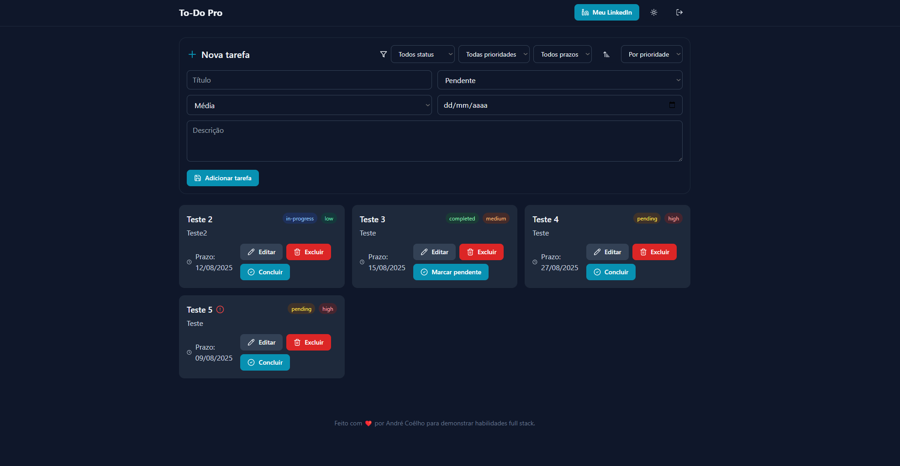
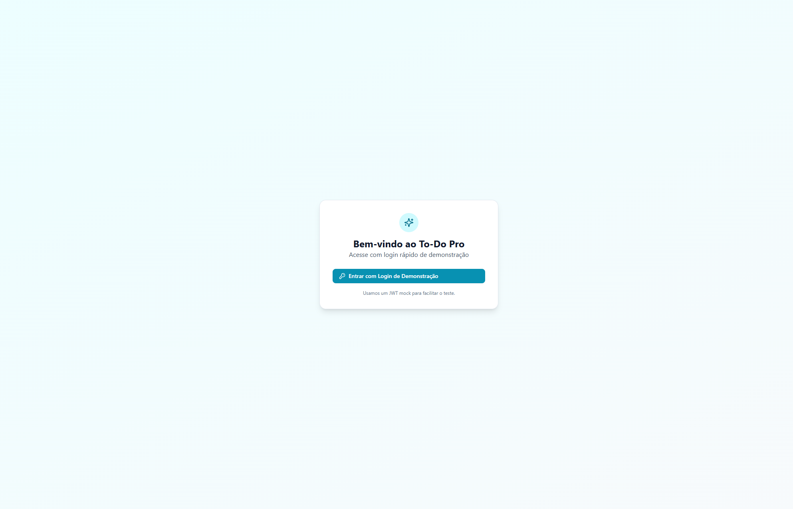

<!-- Logo e Título -->
<p align="center">
	<!--  --> 
	<!-- Substitua por uma imagem em github/logo.png -->
	<!-- Ou remova a tag img se não quiser usar logo -->
</p>

<h1 align="center">To-Do Pro — API + Front-end moderno</h1>

<p align="center">
	Lista de tarefas full stack com autenticação JWT, filtros/ordenação e UI responsiva
  
</p>

<!-- Badges -->
<p align="center">
	<a href="https://github.com/Dec0XD/To-Do-List-API"></a>
	<a href="https://github.com/Dec0XD/To-Do-List-API/issues"></a>
	<a href="http://localhost:5173"></a>
 	<a href="LICENSE"></a>
</p>

---

## 📚 Índice

- [Sobre o Projeto](#-sobre-o-projeto)
- [Tecnologias](#-tecnologias)
- [Instalação](#-instalação)
- [Uso](#-uso)
- [Roadmap](#-roadmap)
- [Por que este projeto é relevante?](#-por-que-este-projeto-é-relevante)
- [Contribuição](#-contribuição)
- [Licença](#-licença)
- [Contato](#-contato)
- [Agradecimentos](#-agradecimentos)

---

## 📌 Sobre o Projeto

Aplicação de To-Do completa, com API Node.js/Express/MongoDB e um front-end moderno em React + Tailwind (Vite).
Foco em boas práticas de arquitetura, experiência do desenvolvedor (DX) e qualidade visual (animações leves, dark mode, ícones Lucide).

**Problema que resolve:** Organização de tarefas pessoais ou de equipe, com suporte a prioridade, status e prazo, otimizando o fluxo de trabalho.

**Diferencial:**
- Camadas bem definidas (Controller / Service / Repository)
- Autenticação JWT com fluxo de mock login para testes rápidos
- Filtros (status/prioridade/prazo) e ordenação (prioridade/data)
- Docker Compose para subir tudo com um único comando
- Interface responsiva, moderna e acessível

<p align="center">
		
</p>

---

## 🛠 Tecnologias

Projeto desenvolvido com:

- 
- 
- 
- 
- 
- 
- 
- 

---

## 🚀 Instalação

Pré-requisitos: Docker e Docker Compose.

1) Rodando com Docker (recomendado)

```powershell
git clone https://github.com/Dec0XD/To-Do-List-API.git
cd To-Do-List-API
docker compose up --build -d

# Endpoints
# API: http://localhost:3000
# Web: http://localhost:5173
```

Para parar:

```powershell
docker compose down
```

2) Rodando localmente (sem Docker)

API

```powershell
cd todo-list-api
npm install
npm start
# API em http://localhost:3000
```

Web

```powershell
cd todo-list-web
npm install
npm run dev
# SPA em http://localhost:5173
```

---

## 💡 Uso

Exemplo (PowerShell) — obter token e listar tarefas:

```powershell
$token = (Invoke-RestMethod -Method Post -Uri http://localhost:3000/api/auth/mock-login).token
Invoke-RestMethod -Method Get -Uri http://localhost:3000/api/tasks -Headers @{ Authorization = "Bearer $token" }
```

Interface (exemplo):

<p align="center">
		
</p>

---

## 🗺 Roadmap

- [x] CRUD de tarefas
- [x] Autenticação JWT (mock login)
- [x] Docker Compose (API + Web + Mongo)
- [x] Filtros por status/prioridade/prazo e ordenação
- [x] UI responsiva, dark mode e ícones
- [ ] Testes unitários e E2E
- [ ] Deploy público (Web: Vercel/Netlify | API: Render/Railway)
- [ ] CI simples (lint/test/build)

---

## 🎯 Por que este projeto é relevante?

Este repositório demonstra um fluxo full stack completo com foco em qualidade de código, separação de camadas e uma UI funcional e refinada.

Ele cobre pontos essenciais para aplicações reais:

- Integração front-back com autenticação e estados assíncronos
- Arquitetura clara e aplicável a projetos escaláveis
- Design responsivo e acessível, incluindo dark mode
- Configuração local simplificada via Docker Compose

---

## 🤝 Contribuição

Contribuições são bem-vindas!

1. Faça um Fork
2. Crie uma branch (`git checkout -b feature/nova-feature`)
3. Commit suas mudanças (`git commit -m "feat: adiciona nova feature"`)
4. Push para a branch (`git push origin feature/nova-feature`)
5. Abra um Pull Request

---

## 📜 Licença

Distribuído sob a licença MIT. Veja o arquivo `LICENSE` para mais detalhes.

---

## 📬 Contato

- Autor: Dec0XD
- LinkedIn: https://www.linkedin.com/in/andré-coêlho
- Repositório: https://github.com/Dec0XD/To-Do-List-API

---

## 🙏 Agradecimentos

- Comunidade Open Source
- Time do Tailwind CSS, Vite, React e Express
- Inspirações de UI modernas (shadcn/ui, hero patterns, etc.)


